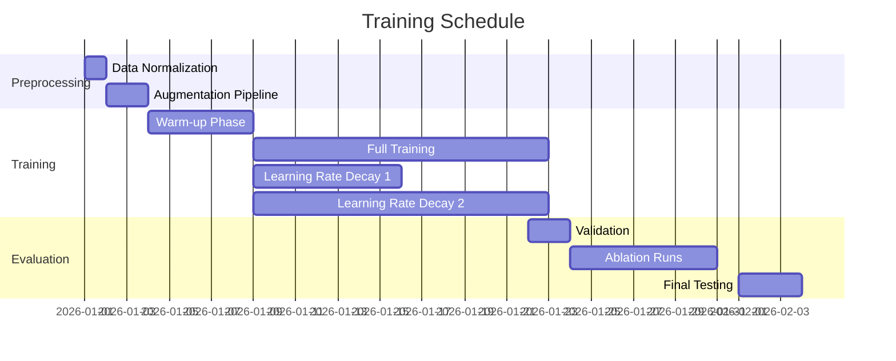

# Executive Summary  
Skeleton-based action recognition has evolved from traditional RNNs to advanced attention-augmented architectures. In recent years, *part-aware* and *attention-enhanced* RNNs have shown strong performance by focusing on the most informative joints in each frame. We design an LSTM/GRU framework that ingests 2D/3D pose keypoints (e.g. COCO-17) and splits them into configurable top-body and bottom-body groups (e.g., “above vs below hips”, or arms vs legs).  Each group is processed by a separate recurrent branch with its own spatial attention (to weigh joints) and temporal attention (to weigh frames).  Externally computed features (joint angles, bone lengths, joint speeds) can be fused either early (concatenated to inputs), mid-network (parallel stream), or late (combined at classification). We recommend bidirectional LSTMs/GRUs with residual skips for deep feature learning. Training uses cross-entropy (optionally with focal loss or class weights for imbalance), dropout, and learning-rate schedules (Adam/AdamW, e.g. 1e-4 initial). Typical augmentation includes adding noise to keypoints, rotating/scaling poses, mirroring left/right, and temporal jittering. Evaluation follows standard protocols (e.g. NTU cross-subject/view accuracies) using classification accuracy and confusion metrics. Key ablations include removing attention, disabling top/bottom split, or testing fusion variants.  We provide a table comparing candidate models (baseline LSTM, attention LSTM, dual-branch LSTM, etc.), and offer implementation sketches (PyTorch) and mermaid-style diagrams for architecture and training flow.  

## Literature Survey (2018–2026)  
Recent years have seen a surge in skeleton-based action recognition, particularly using deep networks. While Graph Convolutional Networks (GCNs) like ST-GCN dominate leaderboards, RNNs remain attractive for their temporal modeling. Early RNN models (e.g. Part-Aware LSTM, STA-LSTM) split the body into parts or learned spatio-temporal attention. For example, Song *et al.* (AAAI 2017) introduced an end-to-end **Spatio-Temporal Attention LSTM** that learns a per-joint spatial attention and per-frame temporal weights. Liu *et al.* (TIP 2018) proposed **GCA-LSTM** with a *global context memory* to iteratively focus on the most informative joints per frame.  Gao *et al.* (Appl. Sci. 2022) use an IndRNN backbone with deep attention networks and a triplet loss to learn multiple attention patterns. Recent transformers like “STEP CATFormer” apply cross-attention on upper/lower body parts, reaffirming the importance of body-part segmentation. These sources demonstrate that **attention mechanisms** (spatial, temporal, or cross-part) can significantly improve performance by focusing on discriminative joints.  

## Data Preprocessing & Normalization  
Raw keypoint sequences must be cleaned and normalized. Common steps include **centering** and **scaling**: e.g. subtract the hip or torso center so the skeleton is root-centered, and normalize by a standard body height or limb length.  In NTU RGB+D preprocessing, one popular approach rotates skeletons to a consistent frontal view and translates the body center to the origin in each frame.  This ensures viewpoint invariance (e.g. making “hopping” actions static under global translation). Noise filtering (e.g. one Euro filter or Kalman smoothing) can reduce jitter in estimated poses. Keypoint formats vary: e.g. COCO uses 17 joints, MPII uses 16, Human3.6M uses 17, etc.  When splitting into top/bottom, one maps indices accordingly (e.g. for COCO: {nose, eyes, ears, shoulders, elbows, wrists} as “top”; {hips, knees, ankles} as “bottom”). Missing points can be interpolated or zeroed.  Optionally, compute **derived features** per frame: joint angles (e.g. knee/hip/elbow angles), bone length ratios, and joint velocity vectors. These features (if available) should be normalized similarly (e.g. subtract mean, scale by body height) before fusion.

## Splitting Keypoints into Top/Bottom  
We define a *configurable mapping* of joints into two subsets. A simple default is **upper vs lower body**: upper-body = all joints above the last lumbar vertebra (head, neck, shoulders, elbows, wrists) and lower-body = all below (hips, knees, ankles). Further refinement is possible: some works treat arms/legs separately or consider hands/feet as distinct. This split can be implemented via an index mask or boolean mask on the keypoint tensor.  For example, with COCO-17 joints, top-body might include indices [0–4, 5–8] (head/shoulders/arms) and bottom-body [9–16] (torso/legs). The mapping should be **parameterized** so users can adapt to other keypoint sets (e.g. a config file listing which joint IDs belong to each part). This yields two sequences: $\mathbf{X}_{\text{top}}$ and $\mathbf{X}_{\text{bottom}}$, each of shape `(seq_len, batch, D1)` and `(seq_len, batch, D2)` respectively, where $D1+D2 = D_{\text{total}}$.  

## Attention Module Designs  
We employ separate attention mechanisms for the top-body and bottom-body branches. Designs include:

- **Spatial attention (joint-level)**: weight the importance of each joint within a frame. For example, we can use a softmax over joints to produce attention scores that multiply the input features. This follows [Song *et al.*’s STA-LSTM]({32†L18-L27}) which learns a per-joint mask. Multi-head spatial attention (like Transformer) could also be applied to allow focusing on multiple joint subsets.  
- **Temporal attention (frame-level)**: weight the importance of each time step. A standard approach is to compute attention weights over the sequence outputs (e.g. as in Bahdanau attention), or use a self-attention block over time. The two can be combined (as in spatio-temporal attention) or used sequentially. Song *et al.* explicitly pays “different levels of attention to the outputs of different frames”, often via a soft-attention pooling of LSTM hidden states.  
- **Separate Top/Bottom attentions**: each body branch has its own spatial and/or temporal attention module. This allows, for example, the top-branch to focus on hands and head, while the bottom-branch focuses on feet and knees. The outputs of these attentions are then fused.  
- **Multi-head vs single-head**: multiple attention heads (as in Transformers) can capture different patterns of co-activation among joints. For instance, one head might focus on arms vs another on legs. While single-head attention is simpler, multi-head may improve capacity.  
- **Gating mechanisms**: inspired by works like Differential RNN or trust-gated LSTM, we can add gates that modulate LSTM inputs/outputs by their change or confidence. For example, one can gate the LSTM input with the attention score, or multiply LSTM hidden states by a learned importance gate. These can improve robustness to noisy joints.  
- **Coordinate vs attention**: Optionally, one may incorporate positional encoding of joints (e.g. distances, angles) into the attention computation to bias the model (like Graph Attention). For example, include joint coordinates or bone-length embeddings as part of the attention query.  

In summary, the design might look like: *Top-branch LSTM → spatial-attention → temporal-attention* and similarly for bottom-branch, possibly interleaving spatial and temporal attention, as in spatio-temporal attention models.  

## Architecture Variants (LSTM/GRU + Attention + Fusion)  
We explore several architectural strategies, which are compared in the table below:

| **Variant**                                       | **Description**                                                                                   | **Pros**                                                             | **Cons / Trade-offs**                                               |
|---------------------------------------------------|---------------------------------------------------------------------------------------------------|----------------------------------------------------------------------|----------------------------------------------------------------------|
| **(A) Baseline RNN**                              | Single LSTM/GRU on all keypoints, no attention.                                                   | Simple, low cost; baseline for comparison.                           | Ignores part distinction; less precise focus on salient joints.    |
| **(B) RNN + Global Attention**                    | Single LSTM + spatial attention over all joints + temporal attention.                             | Focuses on discriminative joints/frames.    | Still treats top/bottom jointly; attention cost adds compute.       |
| **(C) Part-Aware (Hierarchical) RNN**             | Separate LSTMs per body-part (e.g. arms, legs) then fused (as in Part-Aware LSTM). | Captures group-specific dynamics; parallel paths.      | Increases parameter count; needs careful fusion.                    |
| **(D) Two-Stream (Top vs Bottom) RNN**            | One branch for top-body, one for bottom-body (each with own LSTM + attention), fuse later.        | Decouples top/bottom motion; specialized attentions.                 | ~2× computation/params; requires fusion strategy.                   |
| **(E) Dual-Feature Fusion**                       | Two input streams: (1) raw keypoints (via RNN), (2) external features (angles/velocities). Fuse.   | Leverages complementary features; can boost accuracy.      | May need alignment (concatenate or match seq lengths); extra prep. |
| **(F) GRU vs LSTM**                               | Use GRU cells instead of LSTM in any above (fewer gates).                                        | Fewer params, faster training.                                       | LSTM may capture longer dependencies better if sequence is long.    |
| **(G) Bidirectional RNN**                         | Make RNN layers bidirectional (one forward, one backward pass).                                   | Captures future context; often improves accuracy.                    | Doubles compute at inference; not causal (only for offline use).    |
| **(H) Residual/Skip Connections**                 | Add shortcuts (e.g. residual blocks or skip from input to output).                                 | Helps training deep RNN stacks; stabilizes gradients. | Adds model complexity; minor extra compute.                         |
| **(I) Multi-Head Attention Layers**               | Use Transformer-style multi-head attention on sequences (temporal) or joints (spatial).          | High modeling power; captures multiple patterns.                     | Significantly more computation and memory.                          |

Each variant offers a trade-off. For instance, (D) two-stream top/bottom with separate attention can better isolate movements (e.g. upper-body gestures vs leg actions) but costs nearly double parameters. (E) fuses geometric features like joint-angle ratios, which can disambiguate similar poses, at the cost of extra feature computation. We recommend comparing these in ablations.

### Fusion of External Features  
Externally derived features (angles, speeds) can be fused in multiple ways:  
- **Early fusion**: append features to each time-step’s keypoint vector (input to RNN). This treats them as additional channels.  
- **Mid-level fusion**: process raw keypoints with RNN branch and features with a separate branch (e.g. a small MLP or RNN), then combine outputs (concatenate or add) before classification.  
- **Late fusion**: run two full networks (one on keypoints, one on features) and average or train a classifier on their logits.  
For example, [Zou et al. (2020)] compute “modulus ratio” and “vector angle” features, feed them into an LSTM in parallel with the raw keypoint LSTM. Empirically, mid-level fusion (concatenate hidden states) often balances information sharing with model complexity.

## Sequence Handling and RNN Details  
- **Sequence lengths**: Choose a fixed maximum length (e.g. 100 frames), padding shorter sequences and truncating longer ones, or use dynamic RNN (e.g. PyTorch’s `pack_padded_sequence`).  Variable-length handling ensures efficiency and supports batching.  
- **Frame rate alignment**: If external features (like optical flow speeds) have different sampling, resample or align them to keypoint frames.  
- **Bidirectionality**: Use bidirectional LSTM/GRU if future context is available (offline mode). Bidirectional layers double parameters and inference time but often yield better accuracy.  
- **Depth**: Stacking multiple RNN layers (2–4) can capture higher-order patterns. Residual connections (skip-add) between layers help training deeper stacks.  
- **Gating variants**: As in [Du et al. 2015] a hierarchical RNN or part-aware LSTM splits cell states; adding trust gates (like [33†L662-L669]) can gate noisy joints. Such architectural choices are optional but can improve robustness.

## Training Regimen  
- **Loss**: Standard cross-entropy for classification. If classes are imbalanced, apply class-weighting or focal loss. One can add regularization terms: e.g. attention entropy loss or doubly-stochastic attention regularizer to encourage spreading (used in many attention models), or a triplet loss on attention as in [Gao *et al.* 2022] to enforce distinct attention patterns.  
- **Optimization**: Adam or AdamW is recommended (learning rate ~1e-4 initially). Use a scheduler (step decay by 0.1 on plateau or cosine annealing). Clip gradients if exploding is an issue.  
- **Batch size**: 16–128 depending on GPU memory. Larger batches stabilize gradients but require more memory.  
- **Regularization**: Apply dropout (e.g. 0.3–0.5) on inputs and between layers. Weight decay (e.g. 1e-4). Mixup or skeleton-specific augmentation (see below) can further regularize.  
- **Curriculum Learning**: Optionally start training on simpler examples (e.g. shorter sequences or easy classes) and progressively increase difficulty. For example, train first on trimmed clips, then on full videos; or gradually increase sequence length.

## Data Augmentation  
Common skeleton augmentations (to improve generalization) include:  
- **Noise/jitter**: Add small Gaussian noise to joint coordinates or small random shifts in X/Y/Z.  
- **Scale**: Randomly scale skeletons (to simulate distance variations).  
- **Rotation**: Random rotations around the vertical axis (simulate different camera angles).  
- **Translation**: Random shifts of the root joint in the plane.  
- **Temporal**: Randomly drop frames, or play the sequence at different speeds (time scaling).  
- **Flip**: Mirror left-right (swap left/right joints).  
These augmentations should respect limb proportions and be applied consistently to all joints each frame.

## Evaluation Protocol & Metrics  
Use standard train/test splits from skeleton action datasets (e.g. NTU-60/NTU-120: cross-subject and cross-view; Kinetics Skeleton; or custom splits). Metrics: **accuracy** is primary. For multi-label (rare), use mean Average Precision. Also report confusion matrices and per-class recall to identify weaknesses. If using temporal attention, one may also compute Average Precision over attention weights vs ground-truth “key frames” (if available) to measure explainability. Always run multiple random seeds and report mean±std.  

## Ablation Study Suggestions  
To understand design choices, ablate one component at a time:  
- **Attention vs None**: Compare models with spatial/temporal attention vs vanilla LSTM.  
- **Top/Bottom split**: Compare (D) two-stream vs (B) single-stream attention.  
- **Fusion strategy**: Test early vs mid vs late fusion of external features.  
- **Multi-head vs single-head**: Fix total attention parameters but vary heads.  
- **Bidirectional vs uni**: Measure impact on latency vs accuracy.  
- **Layers & sizes**: Vary hidden size (64, 128, 256) and depth.  
- **Regularization**: Dropout off/on, different weight decays, with/without curriculum.  

## Computational Cost & Latency  
An LSTM layer with hidden size *H* and input dim *D* has ~O(H·(H+D)) operations per step. A bidirectional layer doubles this. Multi-head attention adds ~O(T·H²) per sequence (T frames). Our two-stream design roughly doubles the cost of a single-stream model. For example, two 256-hidden bidirectional LSTMs plus one 4-head attention per time-step might require on the order of 10–50 GFLOPs per second of input (depending on T). Inference latency depends on *T* sequential steps; RNNs are inherently sequential (less parallel than CNNs), so batch processing or GPU is crucial. Quantitative estimates: a single LSTM cell (~1024 hidden) is quite fast on GPU (several billion ops/s), so a full model (few million parameters) can run in real-time for moderate T (<200). Memory is dominated by storing RNN hidden states (O(H·T)). Overall, the model is lightweight compared to vision transformers but heavier than simple MLPs.  

## Implementation Notes (PyTorch Snippets)  
Below is a sketch of a dual-branch LSTM+Attention model in PyTorch-style pseudocode (please adapt for real use):

```python
class TopBottomAttentionLSTM(nn.Module):
    def __init__(self, top_in, bot_in, feat_in, hidden_dim, num_heads, num_classes):
        super().__init__()
        # LSTM branches for top and bottom keypoints
        self.lstm_top = nn.LSTM(input_size=top_in, hidden_size=hidden_dim, batch_first=True, bidirectional=True)
        self.lstm_bot = nn.LSTM(input_size=bot_in, hidden_size=hidden_dim, batch_first=True, bidirectional=True)
        # Multi-head attention for top and bottom (using last hidden state as query)
        self.attn_top = nn.MultiheadAttention(embed_dim=2*hidden_dim, num_heads=num_heads, batch_first=True)
        self.attn_bot = nn.MultiheadAttention(embed_dim=2*hidden_dim, num_heads=num_heads, batch_first=True)
        # Fusion and classification
        fused_dim = 2*hidden_dim*2 + feat_in  # top_att + bot_att + extra features
        self.classifier = nn.Linear(fused_dim, num_classes)
        
    def forward(self, top_kp, bot_kp, extra_feat):
        # top_kp: (B, T, top_in), bot_kp: (B, T, bot_in), extra_feat: (B, feat_in)
        top_out, _ = self.lstm_top(top_kp)   # (B, T, 2*hidden_dim)
        bot_out, _ = self.lstm_bot(bot_kp)   # (B, T, 2*hidden_dim)
        # Use last time-step as query for attention (shape (B,1,2H))
        q_top = top_out[:, -1:, :]  # (B, 1, 2H)
        q_bot = bot_out[:, -1:, :]
        # Attend: outputs (B, 1, 2H)
        attn_top, _ = self.attn_top(q_top, top_out, top_out)
        attn_bot, _ = self.attn_bot(q_bot, bot_out, bot_out)
        # Squeeze time dim
        attn_top = attn_top.squeeze(1)  # (B, 2H)
        attn_bot = attn_bot.squeeze(1)
        # Fuse features
        fused = torch.cat([attn_top, attn_bot, extra_feat], dim=1)
        logits = self.classifier(fused)  # (B, num_classes)
        return logits
```

This example uses bidirectional LSTMs and simple cross-attention (query from last state). In practice, you may use more sophisticated attention (e.g. full self-attention) and apply softmax on `logits`.

## Hyperparameter Ranges  
- **Hidden size**: 64–512 per LSTM direction (256 is common). Larger sizes improve capacity but risk overfitting.  
- **Layers**: 1–3 LSTM layers per branch, often with residual links.  
- **Heads**: 1–8 for multi-head attention. Fewer heads reduce compute, more may model diverse cues.  
- **Learning rate**: start 1e-3–1e-4 for Adam; anneal by 5–10× as loss plateaus.  
- **Batch size**: 16–128 (tune based on GPU memory and batch stability).  
- **Dropout**: 0.1–0.5 on LSTM inputs/outputs.  
- **Regularization**: L2 weight decay ~1e-4.  
- **Sequence length T**: depends on dataset (e.g. 100–200 frames). If variable, experiment with padding strategies.  

## Architecture Diagram (Mermaid)

```mermaid
flowchart LR
  subgraph INPUT
    TKP[Top-Body Keypoints (seq)]
    BKP[Bottom-Body Keypoints (seq)]
    FEAT[Extra Features (angles, speeds)]
  end
  subgraph BRANCHES
    LSTM_TOP(LSTM/GRU Top-Body) --> ATT_Top(Spatial/Temporal Attention)
    LSTM_BOT(LSTM/GRU Bottom-Body) --> ATT_Bot(Spatial/Temporal Attention)
    TKP --> LSTM_TOP
    BKP --> LSTM_BOT
  end
  ATT_Top --> FUSE
  ATT_Bot --> FUSE
  FEAT --> FUSE
  FUSE[Fusion & FC] --> OUT[Action Class Probability]
```

## Training Timeline (Mermaid Gantt Chart)



*(Mermaid charts above illustrate the model data flow and a sample training timeline.)*

## Comparative Architecture Summary  
The table above contrasts candidate models. **Vanilla RNNs (A)** serve as a fast baseline, but attention-augmented RNNs **(B)** often yield higher accuracy by focusing on important joints. **Hierarchical/part-aware models (C)** and **two-stream top/bottom (D)** explicitly incorporate human body structure. Combining multiple input streams (joint positions plus angles/speeds) as in (E) enriches the representation. Multi-head attention (I) and bidirectionality boost expressivity but at computational cost. In practice, the optimal choice depends on resource constraints and the target application’s latency requirements.

## References  
Key references include [Liu *et al.* 2018] on global-context LSTMs, [Song *et al.* 2017] on spatio-temporal attention, [Gao *et al.* 2022] on deep attention networks with IndRNN, and [Zou *et al.* 2019] on skeletal geometry features.  Bodies are often partitioned into upper/lower segments, and transformers have explored cross-attention between body parts. Normalization techniques (rotating to frontal view, centering) are documented in the NTU dataset work. We encourage consulting these primary sources for implementation details.  

